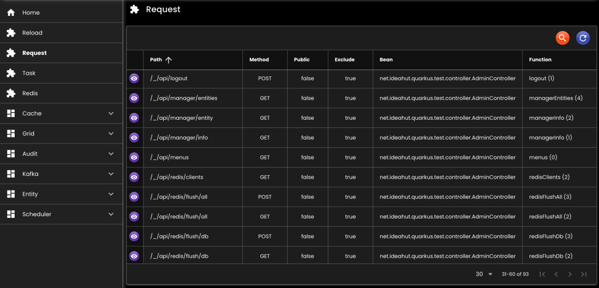

[__Ideahut Quarkus__](./index.md)  

# Advice & RequestInfo Collector

## Advice
- Untuk menangani semua error yang terjadi di aplikasi.

``` java
@Provider
@ApplicationScoped
class Advice extends net.ideahut.quarkus.web.WebAdvice implements ExceptionMapper<Throwable> {
	@Context
	private ContainerRequestContext containerRequestContext;
	
	@Override
	protected ContainerRequestContext containerRequestContext() {
		return containerRequestContext;
	}
	
	@Override
	protected int exceptionStatus(Throwable exception) {
		if (ObjectHelper.isInstance(NotFoundException.class, exception)) {
			return Response.Status.NOT_FOUND.getStatusCode();
		}
		return Response.Status.OK.getStatusCode();
	}

	// Untuk debug
	/**
	@Override
	public Response toResponse(Throwable exception) {
		exception.printStackTrace();
		return super.toResponse(exception);
	}
	*/
}
```

## RequestInfo Collector
- Mengumpulkan endpoint yang tersedia di aplikasi.
- Secara default RequestInfo akan dikumpulkan dari bean-bean yang tersedia di konteks aplikasi.

``` java
@Singleton
@DefaultBean
RequestInfoCollector requestInfoCollector(
	AppProperties appProperties,
	DataMapper dataMapper
) {
	RequestInfoCollectorImpl collector = new RequestInfoCollectorImpl()
	.setDataMapper(dataMapper);
	appProperties.request().ifPresent(definition -> {
		Integer loaderType = definition.loader().orElse(null);
		ClassLoader classLoader = ObjectHelper.callIf(loaderType != null, () -> ObjectHelper.getClassLoader(loaderType));
		ClassScannerInput classScannerInput = new ClassScannerInput();
		classScannerInput.setClassLoader(classLoader);
		definition.packages().ifPresent(classScannerInput::setPackages);
		definition.classes().ifPresent(classScannerInput::setClasses);
		definition.reflection().ifPresent(classScannerInput::setReflection);
		definition.file().ifPresent(collector::setFile);
	});
	return collector;
}
```

## Screenshot

<div>
   
</div>

##

[__Ideahut Quarkus__](./index.md)  
