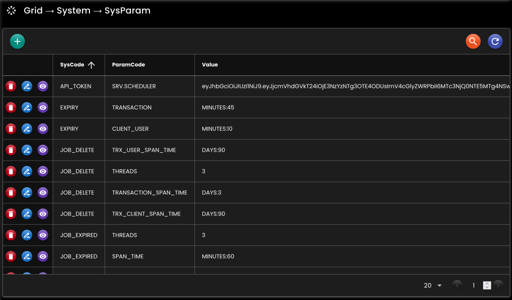

[__Ideahut Quarkus__](./index.md)  

# System Parameter

Menyimpan konfigurasi aplikasi ke database dan [redis](./18-redis.md).
``` java
// SysParamHandler
public interface SysParamHandler {
	SysParamDto getSysParam(String sysCode, String paramCode);
	SysParamMapDto getSysParamMap(String sysCode);
	Map<String, SysParamMapDto> getSysParamMaps(String... sysCodes);
	
	<T> T getValue(Class<T> type, String sysCode, String paramCode, T defaultValue);
	<T> T getValue(Class<T> type, String sysCode, String paramCode);
	
	<T> T getValue(Class<T> type, Map<String, SysParamDto> sysMap, String paramCode, T defaultValue);
	<T> T getValue(Class<T> type, Map<String, SysParamDto> sysMap, String paramCode);
	
	byte[] getBytes(String sysCode, String paramCode, byte[] defaultValue);
	byte[] getBytes(String sysCode, String paramCode);
}

// SysParamRemover
public interface SysParamRemover {
	void removeSysCodes(String... sysCodes);
	void removeSysParam(String sysCode, String paramCode);
}

// SysParamReloader
public interface SysParamReloader {
	void reloadSysCodes(String... sysCodes);
}

// SysParamUpdater
public interface SysParamUpdater {
	void updateSysParam(SysParamDto sysParamDto);
}
```
## Bean

``` java
@Singleton
SysParamHandler sysParamHandler(
    BinarySerializer binarySerializer,
    EntityTrxManager entityTrxManager,
    RedisDataSource redisDataSource
) {
    return new SysParamHandlerImpl()
            
    // Serialize & deserialize byte array ke redis		
    .setBinarySerializer(binarySerializer)
    
    // Daftar Entity class dan nama trxManager yang terkait dengan SysParamHandler
    // default semua class di package 'net.ideahut.quarkus.sysparam.entity'
    .setEntityClass(null)
    
    // EntityTrxManager
    .setEntityTrxManager(entityTrxManager)
    
    // RedisDataSource dan definisi penyimpanan key-nya
    .setRedisParam(
        new RedisParam()	
        .setAppIdEnabled(true)
        .setEncryptEnabled(true)
        .setPrefix("SYS-PARAM")
        .setDataSource(redisDataSource)
    );
}
```

* `setBinarySerializer`: [BinarySerializer](./05-binary.md) bean.
* `setEntityTrxManager`: [EntityTrxManager](./09-trxmanager.md) bean.
* `setEntityClass`: Nama class entity SysParam.
* `setRedisParam`: Redis parameter, termasuk [RedisDataSource](./18-redis.md) dan prefix key-nya.

## Contoh

``` java
@Inject
private SysParamHandler sysParamHandler;

@Public
@GET
@Path("/sysparam/value")
public String value() throws Exception {
    return sysParamHandler.getValue(String.class, "API-TOKEN", "SERVICE-ACCOUNT");
}

@Public
@GET
@Path("/sysparam/maps")
public Map<String, SysParamMapDto> sysParamMaps() throws Exception {
    return sysParamHandler.getSysParamMaps("ARTICLE", "MULTIMEDIA");
}

@Public
@GET
@Path("/sysparam/value")
public SysParamDto sysParamValue() {
    return sysParamHandler.getSysParam("SENTIMENT", "DEFAULT_ANALYZER_ID");
}

@Public
@GET
@Path("/sysparam/reloadSysCodes")
public void reloadSysCodes() {
    ((SysParamReloader) sysParamHandler).reloadSysCodes("ARTICLE", "MULTIMEDIA");
}

@Public
@GET
@Path("/sysparam/removeSysCodes")
public void removeSysCodes() {
    ((SysParamRemover) sysParamHandler).removeSysCodes("ARTICLE", "MULTIMEDIA");
}

@Public
@GET
@Path("/sysparam/reloadSysParam")
public void reloadSysParam() {
    ((SysParamReloader) sysParamHandler).reloadSysParam("SENTIMENT", "DEFAULT_ANALYZER_ID");
}

@Public
@GET
@Path("/sysparam/removeSysParam")
public void removeSysParam() {
    ((SysParamRemover) sysParamHandler).removeSysParam("SENTIMENT", "DEFAULT_ANALYZER_ID");
}
```

## Screenshot

<div>
   
</div>

##

[__Ideahut Quarkus__](./index.md)  

