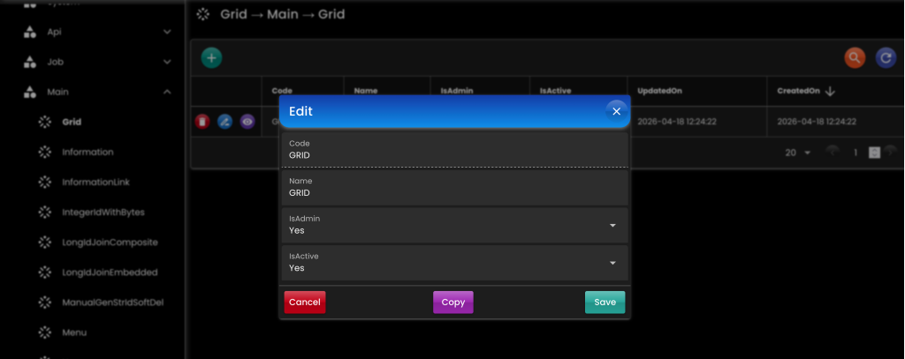

[__Ideahut Quarkus__](./index.md)  

# Grid

- Definisi _User Interface_ (format json atau yaml) untuk menampilkan [CRUD](./10-crud.md).
- Aksi-aksi add, edit, delete juga didefinisikan.
- Contoh file [json](./assets/grid.json) atau [yaml](./assets/grid.yaml).

``` java
public interface GridHandler {
	List<GridParent> getTree();
	JsonNode getGrid(String parent, String name);
	void translate(JsonNode grid);
}
```

## Bean

``` java
@Singleton
GridHandler gridHandler(
    AppProperties appProperties,
    BinarySerializer binarySerializer,
    RedisDataSource redisDataSource
) {
    GridDefinition grid = appProperties.grid().orElseThrow();
    return new GridHandlerImpl()
            
    // Daftar array yang digunakan di template grid, contoh: DAYS, MONTHS, dll		
    .setAdditionals(GridSupport.getAdditionals())
    
    // Serialize & deserialize byte array ke redis
    .setBinarySerializer(binarySerializer)
    
    // File definisi order, title, dll yang akan ditampilakan di UI
    .setDefinition(grid.definition().orElse(null))
    
    // Directory lokasi file-file template
    .setLocation(grid.location().orElse(null))
    
    // Untuk menerjemahkan judul, label, deskripsi, dll yang ada di template grid
    .setMessageHandler(null)
    
    // Daftar option select ynag digunakan di template grid, contoh: GENDER, BOOLEAN, dll
    .setOptions(GridSupport.getOptions())
    
    // RedisDataSource (jika null akan digunakan local memory)
    .setRedisDataSource(!Boolean.TRUE.equals(grid.useLocalMemory().orElse(null)) ? redisDataSource : null)
    
    // Mekanisme penyimpanan key di storage (redis / local memory)
    .setStorageKeyParam(StorageKeyDefinition.convert(grid.storageKeyParam().orElse(null)));
}
```

- `setBinarySerializer`: [BinarySerializer](./05-binary.md) bean.
- `setDefinition`: Definisi grid sebagai alternatif jika diset di konfigurasi / properties.
- `setLocation`: Directory lokasi file-file template grid.
- `setMessageHandler`: Untuk menerjemahkan judul, label, deskripsi, dll yang ada di template grid.
- `setRedisTemplate`: [RedisTemplate](./18-redis.md) bean.
- `setAdditionals`: Daftar array yang digunakan di template grid, contoh: DAYS, MONTHS, dll.
- `setOptions`: Daftar option select ynag digunakan di template grid, contoh: GENDER, BOOLEAN, dll.

## Options

Daftar _option_ yang bisa digunakan oleh grid.

``` java
public interface GridOption {
	List<Option> getGridOptionItems();
}

public class Option implements Serializable {
    private String value; 
    private String label;
    private String icon;
    private String description;
}

// Contoh
public static Map<String, GridOption> getOptions() {
    Map<String, GridOption> options = new HashMap<>();
    options.put("GENDER", StaticOption.GENDER);
    options.put("YES_NO", StaticOption.YES_NO);
    return options;
}
public static class StaticOption {
    // GENDER
    public static final GridOption GENDER =  new GridOptionFromCollector(() ->
        Arrays.asList(
            Option.of("M", "Male"),
            Option.of("F", "Female")
        )
    );
    // YES_NO
    public static final GridOption YES_NO =  new GridOptionFromCollector(() ->
        Arrays.asList(
            Option.of("Y", "Yes"),
            Option.of("N", "No")
        )
    );
}
```

## Additionals

Daftar _additional_ yang bisa digunakan oleh grid.

``` java
public interface GridAdditional {
	ArrayNode getGridAdditionalItems();
}

// Contoh
public static Map<String, GridAdditional> getAdditionals() {
    Map<String, GridAdditional> additionals = new HashMap<>();
    additionals.put("DAYS", StaticAdditional.DAYS);
    return additionals;
}
public static class StaticAdditional {
    // DAYS
    public static final GridAdditional DAYS =  new GridAdditionalFromCollector(() ->
        String str = "[\"Sunday\", \"Monday\", \"Tuesday\", \"Wednesday\", \"Thursday\", \"Friday\", \"Saturday\", \"Sun\", \"Mon\", \"Tue\", \"Wed\", \"Thu\", \"Fri\", \"Sat\"]";
		return FrameworkHelper.defaultDataMapper().read(str, ArrayNode.class);
    );
}
```

## Screenshot

<div>
   
</div>

##

[__Ideahut Quarkus__](./index.md)  
