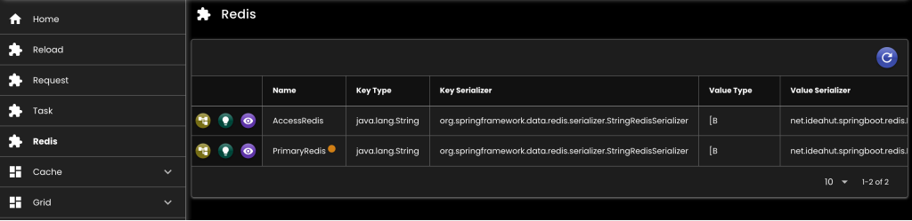
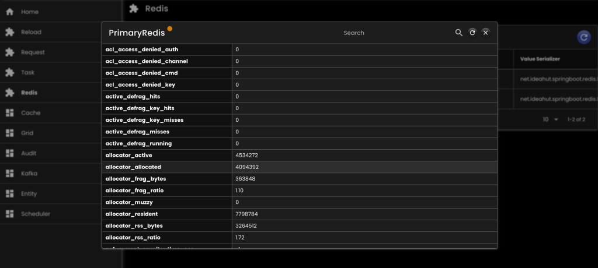
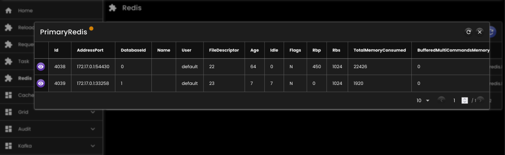

[__Ideahut Quarkus__](./index.md)  

# Redis

## Bean

``` java
@Singleton
RedisDataSource redisDataSource(
   AppProperties appProperties,
   Vertx vertx
) {
   RedisProperties properties = RedisDefinition.convert(appProperties.redis().orElseThrow());
   return RedisHelper.createRedisDataSource(vertx, properties);
}
```

## Type

* `0`: standalone
* `1`: cluster
* `2`: sentinel

## Contoh Properties

``` md
common:
    type: 0
    standalone:
        host: 127.0.0.1
        port: 6379
        password: "<password>"
        database: 0
```

## Screenshot

<div>
   
</div>
<br/>
<div>
   
</div>
<br/>
<div>
   
</div>

##

[__Ideahut Quarkus__](./index.md)  
