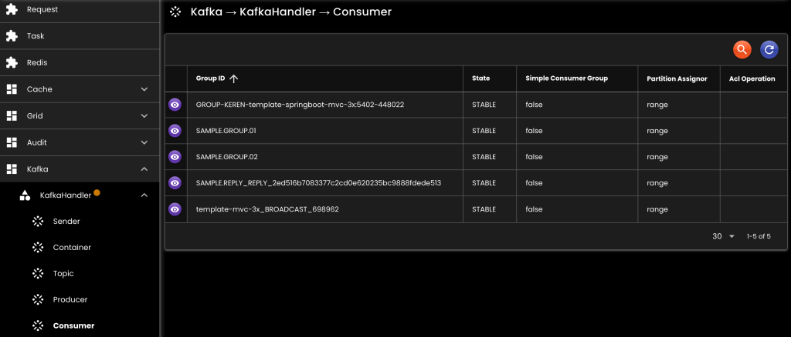

[__Ideahut Quarkus__](./index.md)  

# Kafka
- Untuk menangani _topic_, _producer_, dan _consumer_ kafka.
- Satu KafkaHandler akan menangani hanya satu server kafka.
- KafkaSenderReceiver adalah _sender_ yang menunggu hasil dari _consumer_.

```java
public interface KafkaHandler {
	// Untuk mendapatkan KafkaSender
	<K, V> KafkaSender<K, V> getStaticSender(String topic);
	<K, V, R> KafkaSenderReceiver<K, V, R> getStaticSenderReceiver(String topic);
	
	// Membuat KafkaSender dinamis yang akan mengikuti perubahan KafkaProperties
	<K, V> KafkaSender<K, V> createDynamicSender(String topic);
	<K, V, R> KafkaSenderReceiver<K, V, R> createDynamicSenderReceiver(String topic);
}

public interface KafkaManager {
	Long timestamp(); // waktu terakhir properties di-load
	KafkaProperties properties();
	AdminClient admin();
	KafkaProducerBase producer();
	KafkaConsumerBase consumer();
}
```

## Bean

``` java
@Singleton
KafkaHandler kafkaHandler(
	AppProperties appProperties,
	BinarySerializer binarySerializer,
	DataMapper dataMapper
) {
	KafkaDefinition kafka = appProperties.kafka().orElseThrow();
	if (Boolean.FALSE.equals(kafka.kafkaEnabled().orElse(null))) {
		return KafkaHandler.empty();
	} else {
		return new KafkaHandlerImpl()
		.setBinarySerializer(binarySerializer)
		.setBroadcastEnabled(kafka.broadcastEnabled().orElse(null))
		.setBroadcastTopic(kafka.broadcastTopic().orElse(null))
		.setConfigurationFile(kafka.configurationFile().orElse(null))
		.setDataMapper(dataMapper)
		.setDeleteUnusedGroupAndTopic(kafka.deleteUnusedGroupAndTopic().orElse(null))
		.setProperties(KafkaDefinition.Properties.convert(kafka.properties().orElse(null)))
		.setReloadEnabled(kafka.reloadEnabled().orElse(null));
	}
}
```

- `setBinarySerializer`: [BinarySerializer](./05-binary.md) bean.
- `setBroadcastEnabled`: Untuk komunikasi antar instance dengan topic yang sama, contoh: jika reload di salah satu instance, maka instance lain juga akan di-reload.
- `setBroadcastTopic`: Nama topic yang digunakan untuk broadcast.
- `setProperties`: Kafka properties, atau bisa juga menggunakan configuration file.
- `setDataMapper`: [DataMapper](./04-mapper.md) bean.
- `setDeleteUnusedGroupAndTopic`: Otomatis hapus group dan topic yang tidak terpakai. 
- `setReloadEnabled`: Kafka reload dibolehkan atau tidak.
- `setConfigurationFile`: Kafka properties yang disimpan ke file, [contoh file](./assets/kafka.yaml).

## Screenshot

<div>
   
</div>
<br/>
<div>
   
</div>
<br/>
<div>
   
</div>
<br/>
<div>
   
</div>
<br/>
<div>
   
</div>

##

[__Ideahut Quarkus__](./index.md)  
