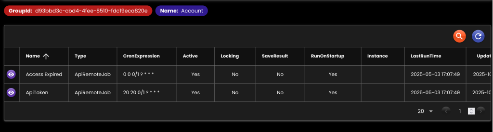

[__Ideahut Quarkus__](./index.md)  

# Scheduler

* Menangani job-job yang bekerja di latar belakang (background).
* Load bisa dibagi berdasarkan instance yang ada.
* Proses start, stop, & pause bisa dilakukan di UI admin.

## Bean

``` java
@Startup
@Singleton
SchedulerHandler schedulerHandler(
   DataMapper dataMapper,
   EntityTrxManager entityTrxManager,
   TaskHandler taskHandler
) throws Exception {
   String vFalse = "false";
   // manual properties, agar SchedulerFactory tidak membuat RMI registry
   // RMI registry di native image akan menyebabkan error
   Properties properties = new Properties();
   properties.setProperty(StdSchedulerFactory.PROP_SCHED_RMI_EXPORT, vFalse);
   properties.setProperty(StdSchedulerFactory.PROP_SCHED_RMI_CREATE_REGISTRY, vFalse);
   properties.setProperty(StdSchedulerFactory.PROP_SCHED_RMI_PROXY, vFalse);
   properties.setProperty("org.quartz.threadPool.threadCount", "10");
   properties.setProperty("org.quartz.threadPool.threadPriority", "5");
   properties.setProperty("org.quartz.threadPool.threadsInheritContextClassLoaderOfInitializingThread", "true");
   StdSchedulerFactory schedulerFactory = new StdSchedulerFactory(properties);
   
   return new SchedulerHandlerImpl()
   
   // DataMapper		
   .setDataMapper(dataMapper)
   
   // Daftar Entity class dan nama trxManager yang terkait dengan SchedulerHandler
   // default semua class di package 'net.ideahut.quarkus.job.entity'
   //.setEntityClass(null)
   
   // EntityTrxManager
   .setEntityTrxManager(entityTrxManager)
   
   // Untuk membagi job yang dieksekusi berdasarkan instance (lihat Entity JobTrigger)
   // Jika tidak diset akan digunakan ID dari application context atau dari property 'quarkus.application.name'
   //.setInstanceId(null)
   
   // Daftar package class-class job, sehingga di database bisa disimpan menggunakan SimpleClassName
   .setJobPackages(Application.Package.APPLICATION + ".job")
   
   // Service untuk menghandle fungsi-fungsi job, seperti mengambil trigger, menyimpan hasil, dll
   // Secara default sudah ada, hanya diperlukan jika custom
   //.setJobService(null)
   
   // SchedulerFactory
   // Secara default sudah ada, hanya diperlukan jika custom
   .setSchedulerFactory(schedulerFactory)
   
   // TaskHandler
   .setTaskHandler(taskHandler)
   
   // Terkait dengan logger, nama key untuk id log yang digenerate random, default: 'traceId'
   //.setTraceKey(null)
   ;
}
```

- `setDataMapper`: [DataMapper](./04-mapper.md) bean.
- `setEntityTrxManager`: [EntityTrxManager](./09-trxmanager.md) bean.
- `setTaskHandler`: [TaskHandler](./14-task.md) bean.
- `setEntityClass`: Daftar entity class yang digunakan (default dari package '_net.ideahut.quarkus.job.entity_').
- `setJobPackages`: List package class-class job.
- `setJobService`: Custom JobService.
- `setSchedulerFactory`: Custom SchedulerFactory.
- `setInstanceId`: ID instance scheduler (default dari property '_quarkus.application.name_'). 
- `setTraceKey`: key yang digunakan di log [MDC](https://logback.qos.ch/manual/mdc.html).
- `setOnStart`: Runnable yang dieksekusi pada saat _start_.
- `setOnStop`: Runnable yang dieksekusi pada saat _stop_.


## Screenshot

<div>
   
</div>
<br/>
<div>
   
</div>

##

[__Ideahut Quarkus__](./index.md)  
