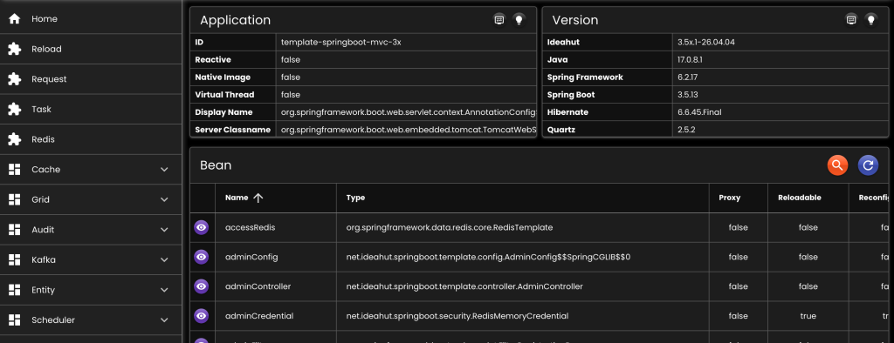
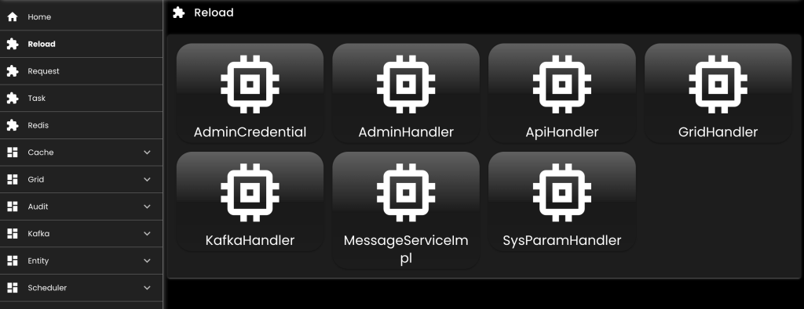
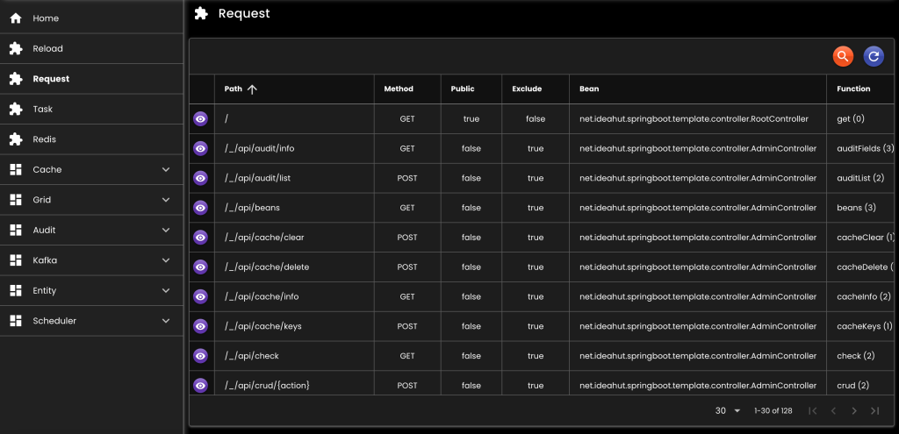

[__Ideahut Quarkus__](./index.md)  

# Admin

Untuk mengakses API dan halaman Admin, yang berguna untuk manajemen service:

* `Reload`: memuat ulang bean tanpa harus merestart service.
* `Request`: daftar request mapping yang tersedia di service.
* [`Redis`](./18-redis.md): daftar redis server yang digunakan di service.
* [`Cache`](./13-cache.md): menghapus / membersihkan data cache baik itu group maupun tunggal.
* [`Grid`](./11-grid.md): mengakses table-table database (operasi [CRUD](./10-crud.md)).
* [`Audit`](./12-audit.md): melihat perubahan-perubahan data dari tabel-tabel database (INSERT, UPDATE, DELETE).
* [`Entity`](./09-trxmanager.md): melihat daftar entity / model yang tersedia berdasarkan transactionManager, termasuk untuk membuat replica & grid.
* [`Scheduler`](./20-scheduler.md): memonitor job, schedule / unschedule job, start / stop scheduler.

## Bean

``` java
// ADMIN HANDLER
@Singleton
@DefaultBean
AdminHandler adminHandler(
   AppProperties appProperties,
   BinarySerializer binarySerializer,
   @Named(AppConstants.Bean.Redis.PRIMARY)
   RedisDataSource redisDataSource,
   RestHandler restHandler,
   RequestInfoCollector requestInfoCollector
) {
   AdminDefinition.Handler handler = appProperties.admin().orElseThrow().handler().orElseThrow();
   
   return new AdminHandlerImpl()
         
   // Memperbaharui data-data di javascript & html resource admin sesuai dengan konfigurasi, seperti: judul, timeout, dll
   .setAfterReload(h -> ModuleAdmin.afterReload(h, ""))
   
   // Path untuk mengakses API Admin
   .setApiPath(handler.apiPath().orElse(null))
   
   // Serialize & deserialize byte array ke redis
   .setBinarySerializer(binarySerializer)
   
   // Custom cek token ke central, secara default sudah tersedia
   //.setCheckTokenCentral(null)
   
   // Lokasi konfigurasi file untuk fitur admin
   .setConfigurationFile(handler.configurationFile().orElse(null))
   
   // Daftar array yang digunakan di template grid, contoh: DAYS, MONTHS, dll
   .setGridAdditionals(GridSupport.getAdditionals())
   
   // Daftar option select ynag digunakan di template grid, contoh: GENDER, BOOLEAN, dll
   .setGridOptions(GridSupport.getOptions())
   
   // Untuk menerjemahkan judul, deskripsi, dll yang ada di template grid
   .setMessageHandler(null)
   
   // Opsi AdminProperties jika configuration file tidak di-set
   .setProperties(null)
   
   // Untuk menyimpan data-data admin, seperti: template grid, authorization, dll
   .setRedisDataSource(redisDataSource)
   
   // Menggunakan nama bean, jika RequestMappingHandlerMapping di application context lebih dari satu
   //.setRequestMappingHandlerMappingBeanName(null)
   
   // Untuk sinkronisasi ke central
   .setRestHandler(restHandler)
   
   // Mekanisme penyimpanan key di storage (redis / local memory)
   .setStorageKeyParam(StorageKeyDefinition.convert(handler.storageKeyParam().orElse(null)))
   
   // Custom sinkronisasi ke central, secara default sudah tersedia 
   //.setSyncToCentral(null)
   
   // Umur cache resource Admin UI
   .setWebCacheMaxAge(TimeValueDefinition.convert(handler.webCacheMaxAge().orElse(null)))
   
   // Flag Admin UI bisa diakses atau tidak
   .setWebEnabled(handler.webEnabled().orElse(null))
   
   // Lokasi resource Admin UI
   .setWebLocation(handler.webLocation().orElse(null))
   
   // Context Path untuk mengakses Admin UI
   .setWebPath(handler.webPath().orElse(null))
   
   // Flag resource chain atau tidak
   .setWebResourceChain(handler.webResourceChain().orElse(null))
   
   // Untuk mendapatkan RequestInfo yang tersedia
   .setRequestInfoCollector(requestInfoCollector);
   
}

// ADMIN CREDENTIAL
@Singleton
@Named(AppConstants.Bean.Credential.ADMIN)
SecurityCredential adminCredential(
   AppProperties appProperties,
   BinarySerializer binarySerializer,
   @Named(AppConstants.Bean.Redis.PRIMARY)
   RedisDataSource redisDataSource
) {
   AdminDefinition.Credential credential = appProperties.admin().orElseThrow().credential().orElseThrow();
   Set<SecurityUser> users = new LinkedHashSet<>();
   credential.users().orElse(Collections.emptyList())
   .forEach(user ->
      users.add(new SecurityUser()
         .setAttributes(ObjectHelper.callIf(null != user.attributes(), () -> new StringMap(user.attributes())))
         .setHosts(ObjectHelper.callIf(null != user.hosts().orElse(null), () -> new StringSet(user.hosts().orElse(null))))
         .setPassword(user.password().orElse(null))
         .setRole(user.role().orElse(null))
         .setUsername(user.username().orElse(null))
      )
   );
   
   if (Boolean.TRUE.equals(credential.useLocalMemory().orElse(null))) {
      
      // Local Memory
      return new LocalMemoryCredential()
            
      // Serialize & deserialize byte array di local memory
      .setBinarySerializer(binarySerializer)
            
      // Cek yang sudah kadaluarsa
      .setCheckInterval(TimeValueDefinition.convert(credential.checkInterval().orElse(null)))
      
      // Lokasi file kredensial
      .setCredentialFile(credential.credentialFile().orElse(null))
      
      // Optional, jika tidak didefinisikan di credential file
      .setExpiry(TimeValueDefinition.convert(credential.expiry().orElse(null)))
      
      // Optional, jika tidak didefinisikan di credential file
      .setPasswordType(credential.passwordType().orElse(null))
      
      // Optional, jika tidak didefinisikan di credential file
      .setUsers(users);
      
      
   } else {
      
      // Redis memory
      return new RedisMemoryCredential()
      
      // Serialize & deserialize byte array di redis	
      .setBinarySerializer(binarySerializer)
      
      // Lokasi file kredensial
      .setCredentialFile(credential.credentialFile().orElse(null))
      
      // Optional, jika tidak didefinisikan di credential file
      .setExpiry(TimeValueDefinition.convert(credential.expiry().orElse(null)))
      
      // Optional, jika tidak didefinisikan di credential file
      .setPasswordType(credential.passwordType().orElse(null))
      
      // RedisTemplate dan definisi penyimpanan key-nya
      .setRedisParam(
         new RedisParam(StorageKeyDefinition.convert(credential.storageKeyParam().orElseThrow()))
         .setDataSource(redisDataSource)
      )
      
      // Optional, jika tidak didefinisikan di credential file
      .setUsers(users);
   }
}

// ADMIN SECURITY
@Singleton
@Named(AppConstants.Bean.Security.ADMIN)
WebSecurity adminSecurity(
   AppProperties appProperties,
   DataMapper dataMapper,
   AdminHandler adminHandler,
   @Named(AppConstants.Bean.Credential.ADMIN)
   SecurityCredential credential
) {
   AdminDefinition.Security security = appProperties.admin().orElseThrow().security().orElseThrow();
   if (Boolean.TRUE.equals(security.useBasicAuth().orElse(null))) {
      
      // Basic Auth
      return new WebBasicAuthSecurity()
            
      // Credential
      .setCredential(credential)
      
      // Realm, ditampilkan di-popup browser
      .setRealm(security.realm().orElse(null));
      
   } else {
      
      // Berdasarkan AdminHandler
      return new AdminSecurity()
            
      // Admin handler		
      .setAdminHandler(adminHandler)
      
      // Credential
      .setCredential(credential)
      
      // DataMapper
      .setDataMapper(dataMapper)
      
      // Pengecekan host yang diperoleh pada saat login
      .setEnableRemoteHost(security.enableRemoteHost().orElse(null))
      
      // Pengecekan User-Agent yang diperoleh pada saat login
      .setEnableUserAgent(security.enableUserAgent().orElse(null))
      
      // Http header untuk menyimpan token, default: 'Authorization'
      .setHeaderKey(security.headerKey().orElse(null));
   }
}
```

## Konfigurasi

``` yaml
# Tunggu semua job selesai pada saat stop scheduler
waitForJobsToCompleteWhenStopScheduler: false

# Ambil metadata dari database
collectDatabaseMetadata: true

# Hanya tampilkan Redis yang bisa dieksekusi
showOnlyExecutableRedis: true

central:
   # Untuk mengambil file template terbaru yang akan diubah sesuai konfigurasi admin
   webEndpoint: "https://central.ideahut.net/sync/web"

   # Untuk mengecek token jika halaman admin dibuka dari central
   tokenEndpoint: "https://central.ideahut.net/sync/token"

# konfigurasi API admin yang akan diset di file template
api:
   timeout: 30
   debug: true

# konfigurasi Web UI yang akan diset di file template
web:
   title: "Template Quarkus"
   indexFile: "index.html"
   alwaysToIndex: true
   color:
      ## css color
      header: ""
      title: ""
      primary: ""
      secondary: ""
      accent: ""
      dark: ""
      positive: ""
      negative: ""
      info: ""
      warning: ""
   allowedPaths:
      ## path yang diizinkan untuk diakses
      - "assets"
      - "icons"
      - "favicon.ico"
      - "index.html"

grid:
   enable: true
   location: "file:{user.dir}/extras/admin/grid/**/*.yaml"
   definition: "file:{user.dir}/extras/admin/grid/grid.def"

crud:
   maxLimit: 200
   useNative: false

role:
   definitionFile: "file:{user.dir}/extras/admin/roles.yaml"

# custom module, seperti: title, urutan / order di menu, aktif / tidak, dan path jika ada custom di controller
modules:
   reload:
      #title:
      #enable:
      #order:
      #path:
   cache: null
   redis: null
   grid: null
   audit: null
   entity: null
   scheduler: null
   task: null
   request: null
```

## Role
Admin user secara default bisa mengakses semua fitur jika role-nya tidak ada.
``` yaml
VIEWER:
   reload:
      enable: false
   redis:
      flushDb: false
      flushAll: false
      items:
   cache:
      single:
         delete: false
         clear: false
         items:
      group:
         delete: false
         clear: false
         items:
   grid:
      actions:
         - PAGE
      items:
         #system:
         #   SysParam:
         #      - PAGE
         #      - UPDATE
   kafka:
      senderControl: false
      containerControl: false
      groupDelete: false
      topicDelete: false
   scheduler:
      control: false
      resetRunning: false
      resetLocking: false
      pause: false
      schedule: false
      trigger: false
```

## Kredensial

``` yaml
# Tipe password: bcrypt, sha-XXX, md-XXX
passwordType: "bcrypt"

# waktu kadaluarsa user yang login
expiry:
   unit: "MINUTES"
   value: 30
   
users:
   -
      username: "admin"
      password: "$2a$10$NL8fAwz/UG6FCk6sEo10Ueuihe.oiX4DQHN4OWqXmDUM9.4Hnu8EC"
      # Bisa mengakses semua fitur admin
   -
      username: "mimin"
      password: "$2a$10$uIAtTYQcSsXOR7xABu/gwOLqf3mOde7z2vZVqug3OjItsdKrmuc5m"
      # hanya bisa akses fitur yang didefinisikan di role VIEWER
      role: "VIEWER"
```

## Controller / Resource

``` java
@ApiExclude
@Path("/_/api")
class AdminController extends net.ideahut.quarkus.admin.AdminControllerBase {
	
	private final DataMapper dataMapper;
	private final AdminHandler adminHandler;
	private final WebSecurity adminSecurity;
	
	AdminController(
		DataMapper dataMapper,
		AdminHandler adminHandler,
		WebSecurity adminSecurity
	) {
		this.dataMapper = dataMapper;
		this.adminHandler = adminHandler;
		this.adminSecurity = adminSecurity;
	}
	
	@Override
	protected DataMapper dataMapper() {
		return dataMapper;
	}
	
	@Override
	protected AdminHandler adminHandler() {
		return adminHandler;
	}
	
	@Override
	protected WebSecurity webSecurity() {
		return adminSecurity;
	}
	
}
```

## Static Resource

- Agar html, css, dan javascript admin bisa diakses dari browser maka harus ditambahkan ke router.
- Penambahan ke router dilakukan di [Launcher](./01-launcher.md) method `onRouter(Router router)`

``` java
@Override
public void onRouter(Router router) {
   AppProperties appProperties = FrameworkHelper.getBean(AppProperties.class);
   AdminHandler adminHandler = FrameworkHelper.getBean(AdminHandler.class);
   ObjectHelper.runIf(
      null != adminHandler, 
      () -> {
         SecurityCredential adminCredential = FrameworkHelper.getBean(AppConstants.Bean.Credential.ADMIN, SecurityCredential.class);
         WebHelper.Router.admin(router, adminHandler, adminCredential, appProperties.publicBaseUrl().orElse(null));
      }
   );
}
```

## Screenshot

<div>
   
</div>
<br/>
<div>
   
</div>
<br/>
<div>
   
</div>

##

[__Ideahut Quarkus__](./index.md)  
